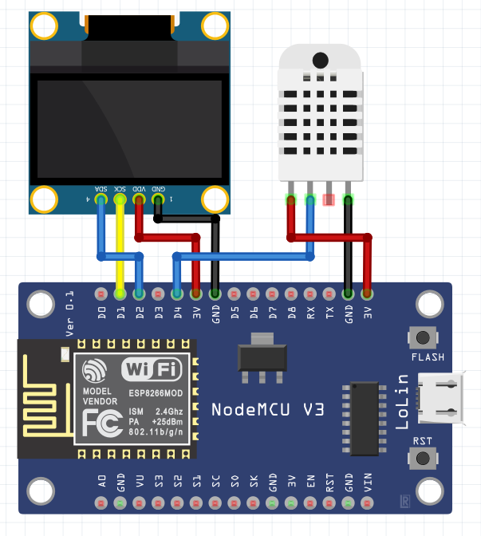

# IoT-Projects
personal IoT Projects, just for fun :)

1. IoT weather station using nodemcu and dht22 sensor to detect ambient humidity and temperature that connected to blynk

Source code: 

2. IoT air quality monitoring using nodemcu, pq135 gas sensor and dht22 
