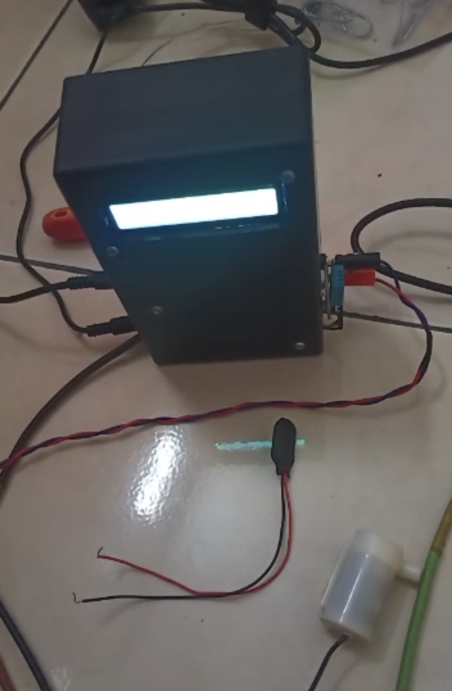

# IoT-Projects
personal IoT Projects, just for fun :)

1. Air quality monitoring PM2.5, temperature and humidity using Sharp GP2Y1010AU0F dust sensor and DHT22

[SOURCE CODE](PM2.5_monitoring.ino)

2. IoT weather station using nodemcu and dht22 sensor to detect ambient humidity and temperature using blynk as platform

[SOURCE CODE](dht22.ino)

3. Implement fuzzy logic mamdani to IoT automatic watering system using nodemcu, soil moisture sensor sensor and DHT11 also connected to firebase as database storage and blynk as platform

[SOURCE CODE](wtpump_fuzzymamdani_soilmoisturesensor.ino)

4. IoT air quality monitoring using nodemcu, pq135 gas sensor and dht22 using blynk as platform

[SOURCE CODE](mq135_DHT22.ino)

